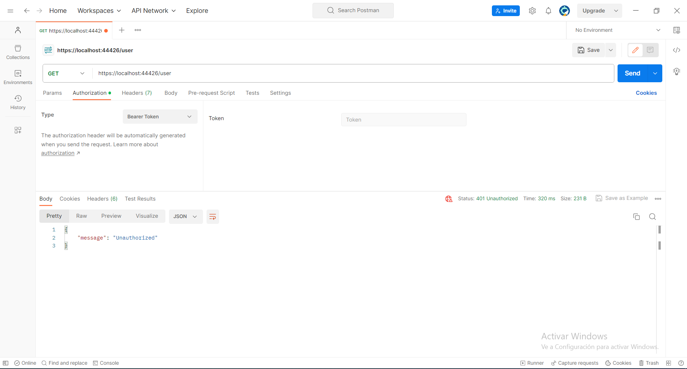
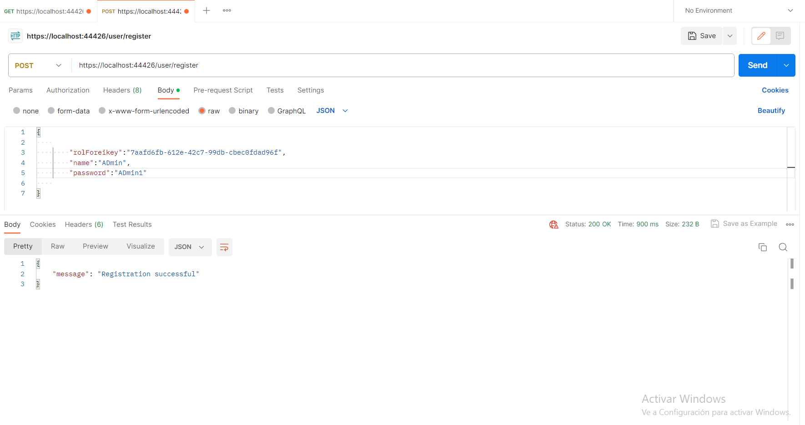
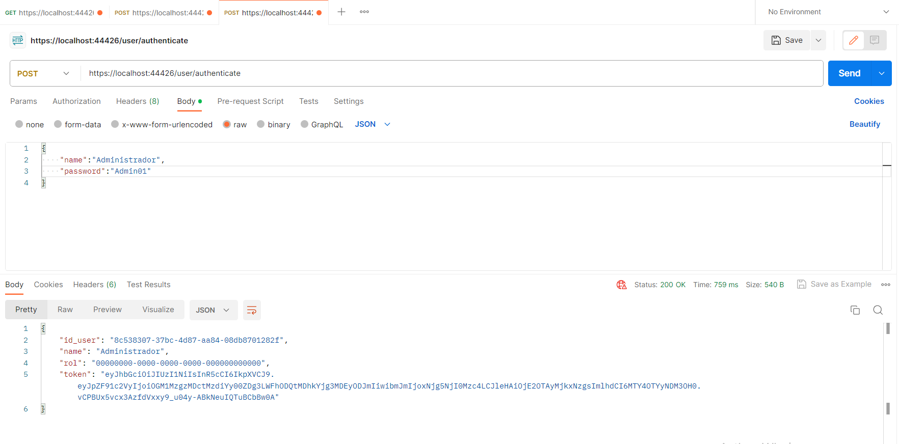
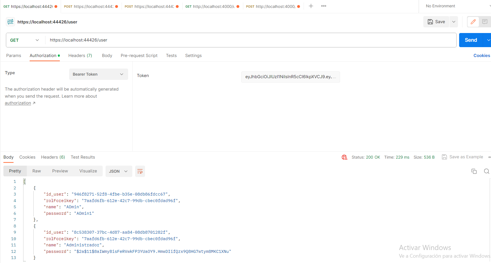
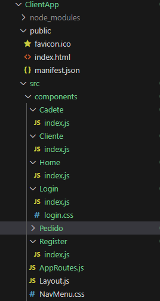
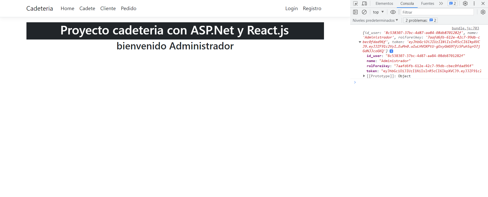
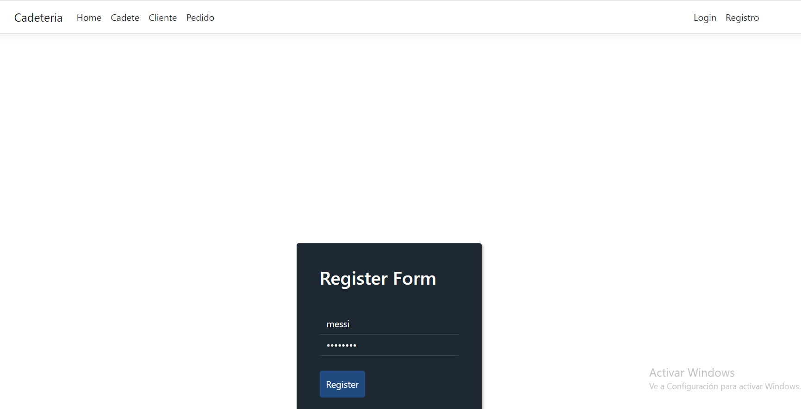
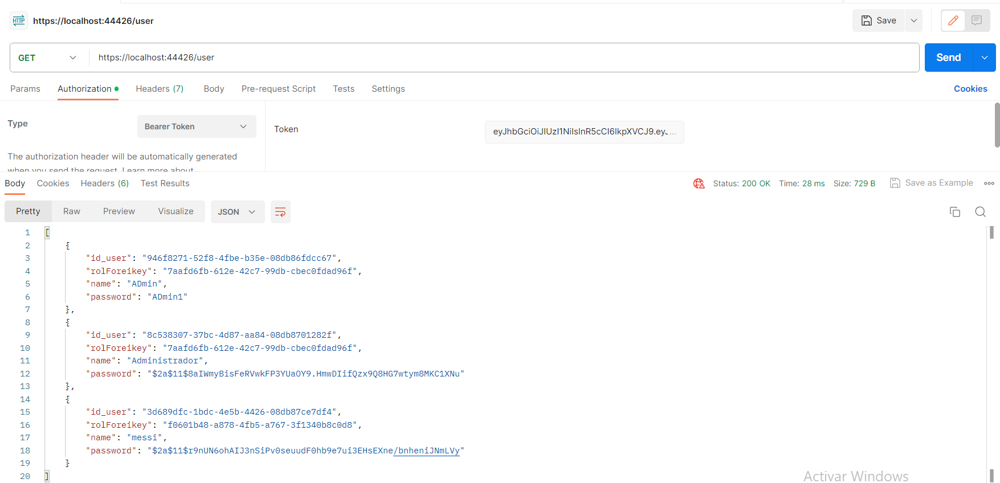
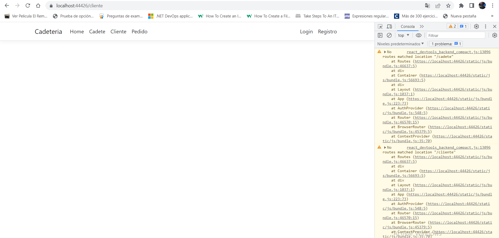
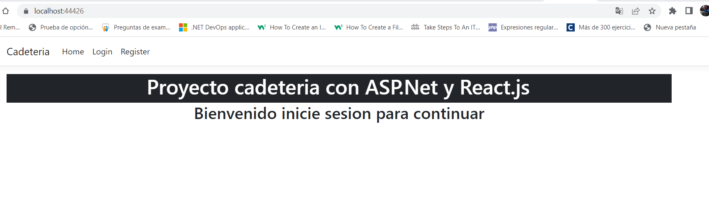

# Proyecto React, api y asp.net

Este va a ser la segunda parte un breve tutorial de cómo crear una aplicación web usando ASP.Net, Entity Framework, JWT, APi-Rest, Fluent-Api y React.
Ambas partes son parte de un conjunto, pero pueden aprenderse por separado. En esté en particular vamos a conectarnos a una base de datos que necesita un token de autenticación para acceder.

##Instalacion de dependencia

Para comenzar este tutorial vamos a ir a la terminal de comando para crear un nuevo proyecto.

    dotnet new react -o my-new-app

Luego entraremos en la carpeta donde esta los archivos de React.js y vamos a intalar las dependencias

    cd my-new-app
    npm i

Para comenzar empezaremos por trabajar en el backend, desde C# para comenzar crearemos una carpeta llamada Models donde guardaremos nuestras clases. En el crearemos los modelos que vamos a usar. Para mayor seguridad, primero crearemos una rama aparte donde trabajaremos con los archivos relacionados con los usuarios.

Una vez creado la rama en nuestro repositorio vamos a instalar las dependencias que vamos a necesitar para hacer nuestro proyecto. Actualmente estoy trabajando con ASp.net 6.0

    dotnet add package AutoMapper --version 12.0.1
    dotnet add package AutoMapper.Extensions.Microsoft.DependencyInjection --version 12.0.1

Estas dependencias nos servirán para copiar un objeto de otro. En esencia las clases son iguales, pero tiene propósitos diferentes. La intención de AutoMapper (o de cualquier mapper) es ahorrarnos la molestia de tener que asignar las propiedades de clase Type A a clase Type B.

    dotnet add package BCrypt.Net-Next --version 4.0.3

Esta dependencia nos va a brindar la encriptación de nuestras contraseñas.

    dotnet add package Microsoft.AspNetCore.Authentication.JwtBearer --version 6.0.8
    dotnet add package System.IdentityModel.Tokens.Jwt --version 6.15.1

JSON Web Token (JWT) es un estándar para transmitir información de forma segura en internet, por medio de archivos en formato JSON

    dotnet add package Microsoft.EntityFrameworkCore --version 6.0.8
    dotnet add package Microsoft.EntityFrameworkCore.Design --version 6.0.8
    dotnet add package Microsoft.EntityFrameworkCore.SqlServer --version 6.0.8

Entity Framework es una herramienta de las catalogadas como ORM (Object Relational Mapping o mapeo a objetos de las bases de datos relacionales) que permite trabajar con las bases de datos relacionales a alto nivel, evitando las complejidades y particularidades del manejo de las tablas de bases de datos, sus relaciones y el uso de SQL.

>nota: Si esta trabajando con versiones diferente de .Net asegurece que las versiones de Entity framework coindidan con la version de .Net o tendra problemas.

## Creacion de Usuarios.

Antes de empezar voy a hacer mencion a [cornflourblue -
Jason Watmore](https://jasonwatmore.com/post/2022/01/07/net-6-user-registration-and-login-tutorial-with-example-api#user-cs) que me ayudo a entender un poco más este tema. Esta parte del trabajo solo será una extensión de la explicación sobre su trabajo, por lo que saltare toda la teoría que sea mencionada en este artículo.

>Recordatorio Importante: Jason Watmore usa **INT** como tipo de datos para los ID, nosotros Usaremos **Guid**, por lo que tendrás que prestar atención para cambiarlos donde requiera ID. Aparte de algunas diferencias con los nombres de las variables, todo se conserva en esencia.

Este parte vamos a manejar la base de datos de usuarios que poseen distintos roles para otorgar los permisos adecuados según sus roles. para ellos comencemos creando los modelos de usuarios.

**Path:/Models/user.cs**

    namespace Cadeteria.Models;

    using System.Text.Json.Serialization;

    public class User
    {
        public Guid Id_user { get; set; }
        public Guid rolForeikey { get; set; }
        public string Name { get; set; }
        public string Password { get; set; }

        [NotMapped]
        [JsonIgnore]
        public virtual Rol? Rol { get; set; }
    }

**Path:/Models/Rol.cs**

    using System.ComponentModel.DataAnnotations.Schema;
    using System.Text.Json.Serialization;

    namespace Cadeteria.Models;

    public class Rol
    {
        public Guid Id_rol { get; set; }
        public string Name { get; set; }

        [NotMapped]
        [JsonIgnore]
        public virtual ICollection<User>? User { get; set; }
    }

Teniendo los modelos vamos a crear Nuestro DataContex donde almacenaremos la lógica para conectar la base de datos.

**Path:/Helpers/DataContext.cs**

    using Microsoft.EntityFrameworkCore;
    using Cadeteria.Models;

    namespace Cadeteria;

        public class DataContext : DbContext
    {

        public DbSet<User> Users { get; set; }
        public DbSet<Rol> rols { get; set; }

        public DataContext(DbContextOptions<DataContext> options) : base(options) { }

        protected override void OnModelCreating(ModelBuilder modelBuilder)
        {
            modelBuilder.Entity<User>(User =>
            {
                User.ToTable("usuario");
                User.HasKey(User => User.Id_user);
                User.Property(User => User.Name).IsRequired().HasMaxLength(15).IsUnicode();
                User.Property(User => User.Password).IsRequired().HasMaxLength(80);

                User.HasOne(r => r.Rol).WithMany(us => us.User).HasForeignKey(r => r.rolForeikey);

            });

            modelBuilder.Entity<Rol>(R =>
            {
                List<Rol> listRol = new List<Rol>();
                listRol.Add(new Rol() { Id_rol = Guid.Parse("7aafd6fb-612e-42c7-99db-cbec0fdad96f"), Name = "admin" });
                listRol.Add(new Rol() { Id_rol = Guid.Parse("7a86db69-1474-4d92-a18e-91899d876c92"), Name = "cadete" });
                listRol.Add(new Rol() { Id_rol = Guid.Parse("f0601b48-a878-4fb5-a767-3f1340b8c0d8"), Name = "cliente" });

                R.ToTable("rol");
                R.HasKey(User => User.Id_rol);
                R.Property(User => User.Name).IsRequired().HasMaxLength(15).IsUnicode();

                R.HasData(listRol);
            });
        }
    }

Aquí Crearemos las primeras columnas de las bases de datos haciendo uso de Fluent para establecer nuestros parámetros. Esta dos tablas estarán relacionada en una relación uno a mucho (1:N).

Vamos a Crear 4 modelos más para seguir con el trabajo, dos ViewModels para el usuario y dos para la autenticación.

**Path:/Models/RegisterRequest.cs**

        using System.ComponentModel.DataAnnotations;

        namespace Cadeteria.Models;

        public class RegisterRequest
        {

            [Required]
            public string Username { get; set; }

            [Required]
            public string Password { get; set; }
        }

**Path:/Models/RegisterRequest.cs**

    namespace Cadeteria.Models;

    public class UpdateRequest
    {
        public string Username { get; set; }
        public string Password { get; set; }
        public Guid rolForeikey { get; set; }
    }

**Path:/Models/AuthenticateResponse.cs**

    namespace Cadeteria.Models;

    using System.ComponentModel.DataAnnotations.Schema;
    using System.Text.Json.Serialization;

    public class AuthenticateResponse
    {
        public int Id { get; set; }
        public string Name { get; set; }
        public string rol { get; set; }
        public string Token { get; set; }
    }

**Path:/Models/AuthenticateRequest.cs**

    public class AuthenticateRequest
    {
        [Required]
        public string Name { get; set; }

        [Required]
        public string Password { get; set; }
    }

**Modificado las entidades para nuestro uso vamos a traernos los Middleware que vamos a usar para la autenticación que están en la carpeta de Authorization de [Jason Watmore](https://github.com/cornflourblue/dotnet-6-registration-login-api/tree/master/Authorization) asi mismo podemos traer el resto de los Helpers que nos ayudaran a darle más robustes al proyecto**

>nota: Si ustedes tan solo copian y pegan lo que les estoy mostrando, inevitablemente tendrán errores. Tomencen el tiempo para ver las diferencias en los nombres, usen El Intellicess de visual estudio code.

Ahora vamos a crear nuestros servicios.

**Path:/Services/IUserRepository.cs**

    using Cadeteria.Models;

    namespace Cadeteria.Services;

    public interface IUserRepository
    {
        AuthenticateResponse Authenticate(AuthenticateRequest model);
        IEnumerable<User> GetAll();
        User GetById(Guid id);
        void Register(RegisterRequest model);
        void Update(Guid id, UpdateRequest model);
        void Delete(Guid id);

    }

**Path:/Services/Repositories/IUserRepository.cs**

    namespace Cadeteria.Services;

    using AutoMapper;
    using BCrypt.Net;
    using Cadeteria.Models;
    using Cadeteria.Authorization;

    public class UserRepository : IUserRepository
    {
        private DataContext _context;
        private IJwtUtils _jwtUtils;
        private readonly IMapper _mapper;

        public UserRepository(
            DataContext context,
            IJwtUtils jwtUtils,
            IMapper mapper)
        {
            _context = context;
            _jwtUtils = jwtUtils;
            _mapper = mapper;
        }

        public AuthenticateResponse Authenticate(AuthenticateRequest model)
        {
            var user = _context.Users.SingleOrDefault(x => x.Name == model.Name);

            // validate
            if (user == null || !BCrypt.Verify(model.Password, user.Password))
                throw new AppException("Username or password is incorrect");

            // authentication successful
            var response = _mapper.Map<AuthenticateResponse>(user);
            response.Token = _jwtUtils.GenerateToken(user);
            return response;
        }

        public IEnumerable<User> GetAll()
        {
            return _context.Users;
        }

        public User GetById(Guid id)
        {
            return getUser(id);
        }

        public void Register(RegisterRequest model)
        {
            // validate
            if (_context.Users.Any(x => x.Name == model.Name))
                throw new AppException("Username '" + model.Name + "' is already taken");

            // map model to new user object
            var user = _mapper.Map<User>(model);

            // hash password
            user.Password = BCrypt.HashPassword(model.Password);

            // save user
            _context.Users.Add(user);
            _context.SaveChanges();
        }

        public void Update(Guid id, UpdateRequest model)
        {
            var user = getUser(id);

            // validate
            if (model.Name != user.Name && _context.Users.Any(x => x.Name == model.Name))
                throw new AppException("Username '" + model.Name + "' is already taken");

            // hash password if it was entered
            if (!string.IsNullOrEmpty(model.Password))
                user.Password = BCrypt.HashPassword(model.Password);

            // copy model to user and save
            _mapper.Map(model, user);
            _context.Users.Update(user);
            _context.SaveChanges();
        }

        public void Delete(Guid id)
        {
            var user = getUser(id);
            _context.Users.Remove(user);
            _context.SaveChanges();
        }

        // helper methods

        private User getUser(Guid id)
        {
            var user = _context.Users.Find(id);
            if (user == null) throw new KeyNotFoundException("User not found");
            return user;
        }
    }

**Path:/Controller/UserController.cs**

    namespace Cadeteria.Controllers;

    using AutoMapper;
    using Microsoft.AspNetCore.Mvc;
    using Microsoft.Extensions.Options;
    using Cadeteria.Authorization;
    using Cadeteria.Models;
    using Cadeteria.Services;

    [Authorize]
    [ApiController]
    [Route("[controller]")]
    public class UserController : ControllerBase
    {
        private IUserRepository _userRepository;
        private IMapper _mapper;
        private readonly AppSettings _appSettings;

        public UserController(
            IUserRepository userService,
            IMapper mapper,
            IOptions<AppSettings> appSettings)
        {
            _userRepository = userService;
            _mapper = mapper;
            _appSettings = appSettings.Value;
        }

        [AllowAnonymous]
        [HttpPost("authenticate")]
        public IActionResult Authenticate(AuthenticateRequest model)
        {
            var response = _userRepository.Authenticate(model);
            return Ok(response);
        }

        [AllowAnonymous]
        [HttpPost("register")]
        public IActionResult Register(RegisterRequest model)
        {
            _userRepository.Register(model);
            return Ok(new { message = "Registration successful" });
        }

        [HttpGet]
        public IActionResult GetAll()
        {
            var users = _userRepository.GetAll();
            return Ok(users);
        }

        [HttpGet("{id}")]
        public IActionResult GetById(Guid id)
        {
            var user = _userRepository.GetById(id);
            return Ok(user);
        }

        [HttpPut("{id}")]
        public IActionResult Update(Guid id, UpdateRequest model)
        {
            _userRepository.Update(id, model);
            return Ok(new { message = "User updated successfully" });
        }

        [HttpDelete("{id}")]
        public IActionResult Delete(Guid id)
        {
            _userRepository.Delete(id);
            return Ok(new { message = "User deleted successfully" });
        }
    }

**Path:/Program.cs**

    using Cadeteria;
    using Cadeteria.Authorization;
    using Cadeteria.Services;
    using Microsoft.EntityFrameworkCore;

    var builder = WebApplication.CreateBuilder(args);

    builder.Services.AddControllersWithViews();

    builder.Services.AddSqlServer<DataContext>(builder.Configuration.GetConnectionString("SQLServer"));

    builder.Services.AddCors();
    builder.Services.AddControllers();

    // configure automapper with all automapper profiles from this assembly
    builder.Services.AddAutoMapper(typeof(Program));

    // configure strongly typed settings object
    builder.Services.Configure<AppSettings>(builder.Configuration.GetSection("AppSettings"));

    builder.Services.AddScoped<IJwtUtils, JwtUtils>();
    builder.Services.AddScoped<IUserRepository, UserRepository>();

    var app = builder.Build();

    // Configure the HTTP request pipeline.
    if (!app.Environment.IsDevelopment())
    {
        // The default HSTS value is 30 days. You may want to change this for production scenarios, see https://aka.ms/aspnetcore-hsts.
        app.UseHsts();
    }

    using (var scope = app.Services.CreateScope())
    {
        var dataContext = scope.ServiceProvider.GetRequiredService<DataContext>();
        dataContext.Database.Migrate();
    }

    {
        // global cors policy
        app.UseCors(x => x
            .AllowAnyOrigin()
            .AllowAnyMethod()
            .AllowAnyHeader());

        // global error handler
        app.UseMiddleware<ErrorHandlerMiddleware>();

        // custom jwt auth middleware
        app.UseMiddleware<JwtMiddleware>();

        app.MapControllers();
    }

    app.UseHttpsRedirection();
    app.UseStaticFiles();
    app.UseRouting();

    app.MapControllerRoute(
        name: "default",
        pattern: "{controller}/{action=Index}/{id?}");

    app.MapFallbackToFile("index.html"); ;

    app.Run();

**Path: /appsettings.json**

    {
        "Logging": {
            "LogLevel": {
            "Default": "Information",
            "Microsoft": "Warning",
            "Microsoft.Hosting.Lifetime": "Information"
            }
        },
        "AppSettings": {
            "Secret": "EstaEsMiSuperLlavePrivadaQueNadiePuedeDecifrarQueTieneNumeritosMira12345"
        },
        "AllowedHosts": "*",
        "ConnectionStrings": {
            "SQLServer": "data source=DESKTOP-R16IMC7;Initial Catalog=Cadeteria;Trusted_Connection=True; TrustServerCertificate=True;"
        }
    }

Por ultimo entraremos en el proxy para decirle a nuestro programa sobre el endpoin que hemos creado.

**ClientApp/src/setupProxy.js**

    const { createProxyMiddleware } = require('http-proxy-middleware');
    const { env } = require('process');

    const target = env.ASPNETCORE_HTTPS_PORT ? `https://localhost:${env.ASPNETCORE_HTTPS_PORT}` :
    env.ASPNETCORE_URLS ? env.ASPNETCORE_URLS.split(';')[0] : 'http://localhost:33787';

    const context = [
    "/weatherforecast",
    "/user",
    ];

    module.exports = function (app) {
    const appProxy = createProxyMiddleware(context, {
        target: target,
        secure: false,
        headers: {
        Connection: 'Keep-Alive'
        }
    });

    app.use(appProxy);
    };

Con todo preparado Ya podemos comenzar la migración de nuestra base de datos para testear nuestros avances.

>**Recordatorio amistoso: ** Si Has llegado hasta aquí, te recomiendo hacer un commit, para asegurar tener un punto de retorno si tienes algún problema. Recuerda también leer completamente la documentación que te di anteriormente.

Terminado aquí corramos nuestro programa, abrimos la dirección de nuestro localHost y abrimos al mismo tiempo Postman. En el vamos a ver, como se puede apreciar en el blog las cuatro situaciones mencionadas.

1- La primera sin autorización 

2- La Segunda Registrando Usuario 

3- La Tercera Accediendo a Usuario y obteniendo Token de autorización 

4- La primera con autorización 

Logrado nuestro objetivo y comprobando que todo funciona correctamente vamos a hacer un Commit y crear una segunda rama para trabajar en paralelo y, en el peor de los casos, evitar romper el programa.

## Front de Usuario.

Hasta ahora tenemos la parte del servidor, pero necesitamos hacerlo accesible al Usuario. Como estamos trabajando con React y creamos un que ya está integrado todo, solo necesitamos llamar al backend como si fuera una api normal. Para ello crearemos un helper aparte.

**Path:/ClientApp/src/Helper.js**

    export const helpHttp = () => {
        const customFetch = (endpoint, options) => {
            const defaultHeader = {
                accept: "application/json",
            };

            const controller = new AbortController();
            options.signal = controller.signal;

            options.method = options.method || "GET";
            options.headers = options.headers
                ? { ...defaultHeader, ...options.headers }
                : defaultHeader;

            options.body = JSON.stringify(options.body) || false;
            if (!options.body) delete options.body;
            //console.log(options);

            setTimeout(() => controller.abort(), 3000);

            return fetch(endpoint, options)
                .then((res) =>
                    res.ok
                        ? res.json()
                        : Promise.reject({
                            err: true,
                            status: res.status || "00",
                            statusText: res.statusText || "Ocurrió un error",
                        })
                )
                .catch((err) => err);
        };

        const get = (url, options = {}) => customFetch(url, options);

        const post = (url, options = {}) => {
            options.method = "POST";
            return customFetch(url, options);
        };

        const put = (url, options = {}) => {
            options.method = "PUT";
            return customFetch(url, options);
        };

        const del = (url, options = {}) => {
            options.method = "DELETE";
            return customFetch(url, options);
        };

        return {
            get,
            post,
            put,
            del,
        };
    };

Este archivo fue facilitado por [Jonmircha](https://jonmircha.com/react). Dejo su página para Agradecer el aporte y Compartirlo con ustedes.

Con esto siempre que tengamos una Url, podremos delegar la función de búsqueda de métodos, y evitar filtrar información innecesaria. Vamos ahora a crear un Loguin y Formulario de registro.

En este caso nosotros podemos optar por crear en un mismo archivo los dos formularios o crear un formulario, para loguear y otro para registrar. Eso dependerá de si quieres reutilizar un formulario y de la metodología de trabajo que estes implementando. Nosotros vamos a implementar ambos en todo el proyecto. Este por ahora vamos a separarlo y que solo se encargue del Loguin.

**Path:/ClientApp/src/components/Login/index.js**

    import React from "react";

    import "./login.css";

    const Login = () => {
        return (
            

                <form method="post">
                    <h2 className="sr-only">Login Form</h2>
                    

                        <i className="icon ion-ios-locked-outline"></i>

                    
<input className="form-control" type="email" name="email" placeholder="Email" />

                    
<input className="form-control" type="password" name="password" placeholder="Password" />

                    
<button className="btn btn-primary btn-block" type="submit">Log In</button>
<a href="#" className="forgot">Forgot your email or password?</a></form>
            

        )
    }
    export default Login;

**Path:/ClientApp/src/components/Login/login.css**

    .login-dark {
        height: 1000px;
        background-size: cover;
        position: relative;
    }

    .login-dark form {
        max-width: 320px;
        width: 90%;
        background-color: #1e2833;
        padding: 40px;
        border-radius: 4px;
        transform: translate(-50%, -50%);
        position: absolute;
        top: 50%;
        left: 50%;
        color: #fff;
        box-shadow: 3px 3px 4px rgba(0, 0, 0, 0.2);
    }

    .login-dark .illustration {
        text-align: center;
        padding: 15px 0 20px;
        font-size: 100px;
        color: #2980ef;
    }

    .login-dark form .form-control {
        background: none;
        border: none;
        border-bottom: 1px solid #434a52;
        border-radius: 0;
        box-shadow: none;
        outline: none;
        color: inherit;
    }

    .login-dark form .btn-primary {
        background: #214a80;
        border: none;
        border-radius: 4px;
        padding: 11px;
        box-shadow: none;
        margin-top: 26px;
        text-shadow: none;
        outline: none;
    }

    .login-dark form .btn-primary:hover,
    .login-dark form .btn-primary:active {
        background: #214a80;
        outline: none;
    }

    .login-dark form .forgot {
        display: block;
        text-align: center;
        font-size: 12px;
        color: #6f7a85;
        opacity: 0.9;
        text-decoration: none;
    }

    .login-dark form .forgot:hover,
    .login-dark form .forgot:active {
        opacity: 1;
        text-decoration: none;
    }

    .login-dark form .btn-primary:active {
        transform: translateY(1px);
    }

>Nota: Si deseas puedes Crear tu propio Formulario, yo simplemente busque uno y lo adapte a mis necesidades.

Sin miedo al éxito vamos a borrar los componentes que no vamos a usar como home, cunter y fechData.
Luego crearemos algunas carpetas con los nombres de los componentes y su archivo index. dentro crearemos archivos que solo tendrán un título para reconocer que componente son

**Paht:ClienteApp/Components/Home/index.js**

    import React from "react";

    const Home = () => {
        return (
            

                <h1 className="text-center text-white">Proyecto cadeteria con ASP.Net y React.js </h1>.
            

        )
    }
    export default Home;

Luego de crear todos nuestros componentes vamos a ir al archivo appRoutes y cambiaremos el contenido.

**Paht:ClienteApp/AppRoutes.js**

    import Login from "./components/Login";
    import Register from "./components/Register";
    import Home from './components/Home';
    import Cadete from './components/Cadete';
    import Pedido from './components/Pedido';
    import Cliente from './components/Cliente';

    const AppRoutes = [
    {
        index: true,
        element: <Home />
    },
    {
        path: '/login',
        element: <Login />

    },
    {
        path: '/register',
        element: <Register />

    },
    {
        path: 'cadete',
        element: <Cadete />

    },
    {
        path: 'cliente',
        element: <Cliente />
    },
    {
        path: 'pedido',
        element: <Pedido />
    },
    ];

    export default AppRoutes;

Y agregamos nuestras nuevas rutas en el componente nav.

**Paht:ClienteApp/src/NavMenu.js**

    import React, { Component } from 'react';
    import { Collapse, Navbar, NavbarBrand, NavbarToggler, NavItem, NavLink } from 'reactstrap';
    import { Link } from 'react-router-dom';
    import './NavMenu.css';

    export class NavMenu extends Component {
    static displayName = NavMenu.name;

    constructor(props) {
        super(props);

        this.toggleNavbar = this.toggleNavbar.bind(this);
        this.state = {
        collapsed: true
        };
    }

    toggleNavbar() {
        this.setState({
        collapsed: !this.state.collapsed
        });
    }

    render() {
        return (
        <header>
            <Navbar className="navbar-expand-sm navbar-toggleable-sm ng-white border-bottom box-shadow mb-3" container light>
            <NavbarBrand tag={Link} to="/">Cadeteria</NavbarBrand>
            <NavbarToggler onClick={this.toggleNavbar} className="mr-2" />
            <Collapse className="d-sm-inline-flex flex-sm-row-reverse" isOpen={!this.state.collapsed} navbar>
                <ul className="navbar-nav flex-grow">
                <NavItem>
                    <NavLink tag={Link} className="text-dark" to="/">Home</NavLink>
                </NavItem>
                <NavItem>
                    <NavLink tag={Link} className="text-dark" to="/login">Login</NavLink>
                </NavItem>
                <NavItem>
                    <NavLink tag={Link} className="text-dark" to="/cadete">Cadete</NavLink>
                </NavItem>
                <NavItem>
                    <NavLink tag={Link} className="text-dark" to="/cliente">Cliente</NavLink>
                </NavItem>
                <NavItem>
                    <NavLink tag={Link} className="text-dark" to="/pedido">Pedido</NavLink>
                </NavItem>
                <NavItem>
                    <NavLink tag={Link} className="text-dark" to="/register">Registro</NavLink>
                </NavItem>
                </ul>
            </Collapse>
            </Navbar>
        </header>
        );
    }
    }

Para las cuestiones estéticas lo dejo a gusto de cada uno. Conectemos nuestro componente loguin con nuestra base de datos. Para ello vamos a Crear un ReactContext para ahorrarnos algunas molestias de tener que llamar siempre las mismas funciones.

**Paht:ClienteApp/src/ApiContext.js**

    import React from "react";
    import { useState, useEffect } from "react";
    import { helpHttp } from "./Helper";

    const GlobalContext = React.createContext();

    const ContextProvider = (props) => {

        const [db, setDb] = useState([]);
        const [dataToEdit, setDataToEdit] = useState(null);
        const [url, setUrl] = useState(null);

        const [loading, setLoading] = useState(false);
        const [error, setError] = useState(false);

        const api = helpHttp();

        useEffect(() => {
            setLoading(true);
            helpHttp().get(url).then((res) => {
                if (!res.err) {
                    setDb(res);
                    setError(null);
                } else {
                    setDb(null);
                    setError(res);
                }
                setLoading(false);
            });
        }, [url]);

        const createData = (data) => {
            delete data.id
            let options = {
                body: data,
                headers: { "content-type": "application/json" },
            };
            helpHttp().post(url, options).then((res) => {
                if (res.err) {
                    let newData = db.map((el) => (el.id !== data.id ? data : el));
                    setDb(newData);
                } else {
                    setError(res);
                }
            })
        }
        const createCp = (data) => {

            let options = {
                body: data,
                headers: { "content-type": "application/json" },
            };
            helpHttp().post("/api/cadetepedido", options).then((res) => {
                if (res.err) {
                    console.log(res);
                } else {
                }
            })
        }

        const updateData = (data) => {
            let id = data.id_cadete || data.id_cliente
            let endpoint = `${url}/${id}`;
            let options = {
                body: data,
                headers: { "content-type": "application/json" },
            };
            api.put(endpoint, options).then((res) => {
                if (!res.err) {
                    if (data.id_cadete) {
                        var newData = db.map((el) => (el.id_cadete === data.id_cadete ? data : el));
                    } else {
                        var newData = db.map((el) => (el.id_cliente === data.id_cliente ? data : el));
                    }
                    setDb(newData);
                } else {
                    setError(res);
                }
            });
        }
        const updatePedido = (data) => {

            let id = data.id_pedido
            let endpoint = `/api/pedido/${id}`;
            let options = {
                body: data,
                headers: { "content-type": "application/json" },
            };
            api.put(endpoint, options).then((res) => {
                if (!res.err) {
                    var newData = db.map((el) => (el.id_pedido === data.id_pedido ? data : el));
                    setDb(newData);
                } else {
                    setError(res);
                }
            });
        }

        const deleteData = (id) => {
            let isDelete = window.confirm(
                `¿Estás seguro de eliminar el registro con el id '${id}'?`
            );
            if (isDelete) {
                let endpoint = `${url}/${id}`;
                let options = {
                    headers: { "content-type": "application/json" },
                };
                api.del(endpoint, options).then((res) => {
                    if (!res.err) {
                        let newData = db.filter((el) => el.id !== id);
                        setDb(newData);
                    } else {
                        setError(res);
                    }
                });
            } else {
                return;
            }
        }

        const deleteCp = (id) => {
            let isDelete = window.confirm(
                `¿Estás seguro de Cancelar el Pedido?`
            );
            if (isDelete) {
                let endpoint = `/api/cadetepedido/${id}`;
                let options = {
                    headers: { "content-type": "application/json" },
                };
                api.del(endpoint, options).then((res) => {
                    if (!res.err) {
                        let newData = db.filter((el) => el.id !== id);
                        setDb(newData);
                    } else {
                        setError(res);
                    }
                });
            } else {
                return;
            }
        }

        return (
            <GlobalContext.Provider value={{
                db,
                setDb,
                url,
                setUrl,
                dataToEdit,
                setDataToEdit,
                error,
                setError,
                loading,
                setLoading,
                createData,
                deleteData,
                updateData,
                updatePedido,
            }} >
                {props.children}
            </GlobalContext.Provider>
        )
    }
    export { ContextProvider, GlobalContext }

>Nota: Vamos a ir agregando dependiendo de la necesidad, por el momento vamos a usar estos.

## Conexión a Base de datos

Para conectar nuestra base de datos con nuestro archivo React nosotros necesitamos consumirla como cualquier Api normal. para ello dejamos las funciones necesarias en nuestro ApiContext y helpers. Ahora vamos a realizar la vista de los usuarios y las llamadas a la base de datos correspondiente.
**Path:ClientApp/src/components/Home/index.js**

    import React, { useState } from "react";
    import { GlobalContext } from "../../ApiContext";
    import { useNavigate } from "react-router-dom";

    import "./login.css";
    import { helpHttp } from "../../Helper";

    const InitialForm = {
        name: "",
        password: "",
    }

    const Login = () => {

        const [form, setForm] = useState(InitialForm);
        const {
            setUrl,
            url,
            setUser,
        } = React.useContext(GlobalContext)

        setUrl("/user/authenticate");

        const navigate = useNavigate();

        const handleChange = (e) => {
            setForm({
                ...form,
                [e.target.name]: e.target.value,
            });
        };

        const handleSubmit = (e) => {
            e.preventDefault();
            let options = {
                body: form,
                headers: { "content-type": "application/json" },
            };
            helpHttp().post(url, options).then((res) => {
                if (!res.err) {
                    setUser(res)
                    navigate("/")
                } else {
                    console.log(res)
                }
            })
        };

        return (
            

                <form method="post" onSubmit={handleSubmit}>
                    <h2 className="sr-only">Login Form</h2>
                    

                        <i className="icon ion-ios-locked-outline"></i>

                    

                        <input className="form-control" type="text" name="name" placeholder="UserName" value={form.name} onChange={handleChange} />

                    

                        <input className="form-control" type="password" name="password" placeholder="Password" value={form.password} onChange={handleChange} />

                    

                        <button className="btn btn-primary btn-block" type="submit">Log In</button>
<a href="#" className="forgot">Forgot your email or password?</a></form>
            

        )
    }
    export default Login;

En nuestro archivo vemos la llamada a nuestro contextProvaider, claro que esto no va a funcionar correctamente solo porque sí. Para que ande, este tiene que tener un determinado Alcance. Como no tengo idea cuál es tu nivel de React.js vamos a hacer fácil y colocarlo en el index.
**Path:ClientApp/src/index.js**

    <ContextProvider>
        <BrowserRouter basename={baseUrl}>
        <App />
        </BrowserRouter>
    </ContextProvider>

    En el archivo del Login vemos que si nuestro solicitud es aceptada, nos enviara a nuestro componente Home o donde podemos hacer uso de los datos que nos trajo el servidor.

**Path:ClientApp/src/components/Home/index.js**

    import React from "react";
    import { GlobalContext } from "../../ApiContext";

    const Home = () => {
        const {
            user
        } = React.useContext(GlobalContext)

        console.log(user)

        return (
            <>
                

                    <h1 className="text-center text-white">Proyecto cadeteria con ASP.Net y React.js </h1>.
                

                <h2 className="text-center">bienvenido {user.name} </h2>
            </>
        )
    }
    export default Home;

>Nota: cambie un poco de diseño para más placer.

Ahora trabajemos en la parte del registro y por último sobre la persistencia de datos, para lo demás lo dejamos en la primera parte.
**Path:ClientApp/src/components/Register/index.js**

    import React, { useState } from "react";
    import { GlobalContext } from "../../ApiContext";

    const InitialForm = {
        name: "",
        password: "",
    }

    const Register = () => {

        const [form, setForm] = useState(InitialForm);

        const {
            setUrl,
            createData
        } = React.useContext(GlobalContext)

        setUrl("/user/register");

        const handleChange = (e) => {
            setForm({
                ...form,
                [e.target.name]: e.target.value,
            });
        };

        const handleSubmit = (e) => {
            e.preventDefault();
            createData(form)
        }

        return (
            <>
                

                    <form method="post" onSubmit={handleSubmit}>
                        <h2 className="sr-only">Register Form</h2>
                        

                            <i className="icon ion-ios-locked-outline"></i>

                        

                            <input className="form-control" type="text" name="name" placeholder="UserName" value={form.name} onChange={handleChange} />

                        

                            <input className="form-control" type="password" name="password" placeholder="Password" value={form.password} onChange={handleChange} />

                        

                            <button className="btn btn-primary btn-block" type="submit">Register</button>
                        

                    </form>
                

            </>
        )
    }
    export default Register;

Aquí usamos la función que guardamos en nuestro UseContext. Las validaciones de contraseña, será problema de otro tema aparte, por ahora solo concentrémonos en lo que tenemos por delante.
En cuanto al rol que tomamos, en mi caso simplemente lo guarde por defecto como un "cliente" desde el controlador

    [AllowAnonymous]
    [HttpPost("register")]
    public IActionResult Register(RegisterRequest model)
    {
        model.rolForeikey = Guid.Parse("f0601b48-a878-4fb5-a767-3f1340b8c0d8");
        _userRepository.Register(model);
        return Ok(new { message = "Registration successful" });
    }

Se puede hacer de esta manera, guardarlo con este código desde el lado del servidor. el hecho que no cambia el resultado. A medida que sigas creciendo sabrás que es lo que corresponde a buenas prácticas y que no.
Para demostrar que funciona, voy a subir dos imagenes.

## Persistencia de Datos

No voy a tocar las otras funciones como delete y update, ya que fueron tocadas en la primera parte. Vamos a concentrarnos en la persistencia de datos.

Si pones a probar veras que gracias a que guardamos nuestro usuario en nuestro UseContext, podemos mantener una cierta persistencia en los datos, pero en el momento que nosotros refrescamos la pantalla esta persistencia desaparece.

Como siempre antes de empezar hagamos un commit y creemos una nueva rama. Luego vamos a nuestra terminal de comando y instalamos el para las cookies. Documentación [por Aqui](https://www.npmjs.com/package/universal-cookie)

    npm i universal-cookie

Luego vamos a agregar a nuestro apiContext nuevas funciones para guardar y eliminar cookies.
**Path:ClientApp/src/ApiContext.js**

    import React from "react";
    import { useState, useEffect } from "react";
    import { helpHttp } from "./Helper";
    import Cookies from 'universal-cookie';

    const GlobalContext = React.createContext();

    const ContextProvider = (props) => {

        const cookies = new Cookies();

        ...

        const IniciarSesion = (data) => {
            cookies.set('id', data.id_user, { path: '/' })
            cookies.set('name', data.name, { path: '/' })
            cookies.set('rol', data.rol, { path: '/' })
            cookies.set('Token', data.token, { path: '/' })
        }

        const cerrarSesion = () => {
            cookies.remove('id', { path: '/' })
            cookies.remove('name', { path: '/' })
            cookies.remove('rol', { path: '/' })
            cookies.remove('Token', { path: '/' })
        }

        return (
            <GlobalContext.Provider value={{
                cookies,
                IniciarSesion,
                cerrarSesion,
                db,
                ...
            }} >
                {props.children}
            </GlobalContext.Provider>
        )
    }

    export { ContextProvider, GlobalContext }

Agregamos la función en nuestro HandelSubmit y delegamos la responsabilidad de mantener nuestros usuarios a las cookies.
**Path:ClientApp/src/componests/Login/index.js**

    const Login = () => {

        const [form, setForm] = useState(InitialForm);
        const {
            setUrl,
            url,
            IniciarSesion,
        } = React.useContext(GlobalContext)

        setUrl("/user/authenticate");

        const navigate = useNavigate();

        const handleChange = (e) => {
            setForm({
                ...form,
                [e.target.name]: e.target.value,
            });
        };

        const handleSubmit = (e) => {
            e.preventDefault();
            let options = {
                body: form,
                headers: { "content-type": "application/json" },
            };
            helpHttp().post(url, options).then((res) => {
                if (!res.err) {
                    IniciarSesion(res)
                    navigate("/")
                } else {
                    console.log(res)
                }
            })
        };

        return (
            

                <form method="post" onSubmit={handleSubmit}>
                    <h2 className="sr-only">Login Form</h2>
                    

                        <i className="icon ion-ios-locked-outline"></i>

                    

                        <input className="form-control" type="text" name="name" placeholder="UserName" value={form.name} onChange={handleChange} />

                    

                        <input className="form-control" type="password" name="password" placeholder="Password" value={form.password} onChange={handleChange} />

                    

                        <button className="btn btn-primary btn-block" type="submit">Log In</button>
<a href="#" className="forgot">Forgot your email or password?</a></form>
            

        )
    }
    export default Login;

Hacems unos pequeños cambios en el Home para hacerlos perceptibles.
**Path:ClientApp/src/componests/Home/index.js**

import React from "react";
import { GlobalContext } from "../../ApiContext";

const Home = () => {

    const {
        cookies,
    } = React.useContext(GlobalContext);

    return (
        <>
            

                <h1 className="text-center text-white">Proyecto cadeteria con ASP.Net y React.js </h1>.
            

            <h2 className="text-center">bienvenido {cookies.get('name') ? cookies.get("name") : "inicie sesion para continuar"}</h2>
        </>
    )
}

export default Home;

Para poder acceder a nuestra base de datos con el token es necesario hacer un cambio en el header de nuestra api, por ejemplo si queremos acceder al método getUser, vamos a agregar el método donde hacemos la solicitudes Get de esta manera.

    useEffect(() => {
            setLoading(true);
            let options = {
                headers:
                {
                    "Authorization": "Bearer " + cookies.get("Token")
                }
            };
            helpHttp().get(url, options).then((res) => {
                if (!res.err) {
                    setDb(res);
                    setError(null);
                } else {
                    setDb(null);
                    setError(res);
                }
                setLoading(false);
            });
        }, [url]);

El problema de esto es que todas las solicitudes van a ir con el token, necesiten o no, por lo que sería mejor crear un nuevo Componente que manejara las solicitudes privadas. En el moveremos el método que creamos para loguearnos y agregaremos el resto de la lógica para trabajar.
**Path:ClienApp/src/components/Auth/index,js**

    import React from "react"
    import Cookies from 'universal-cookie';

    const authContext = React.createContext();

    function AuthProvider({ children }) {

        const cookies = new Cookies();

        useEffect(() => {
            setLoading(true);
            let options = {
                headers:
                {
                    "Authorization": "Bearer " + cookies.get("Token")
                }
            };
            helpHttp().get(url, options).then((res) => {
                if (!res.err) {
                    setDb(res);
                    setError(null);
                } else {
                    setDb(null);
                    setError(res);
                }
                setLoading(false);
            });
        }, [url]);

        const UpdateWithToken = (id) => {
            let endpoint = `${url}/${id}`;
            let options = {
                body: data,
                headers: { "content-type": "application/json" },
            };
            api.put(endpoint, options).then((res) => {
                if (!res.err) {

                } else {
                    setError(res);
                }
            });
        }

        const deleteWithToken = (id) => {
            let isDelete = window.confirm(
                `¿Estás seguro de eliminar el registro con el id '${id}'?`
            );
            if (isDelete) {
                let endpoint = `${url}/${id}`;
                let options = {
                    headers: { "content-type": "application/json" },
                };
                api.del(endpoint, options).then((res) => {
                    if (!res.err) {
                    } else {
                        setError(res);
                    }
                });
            } else {
                return;
            }

            const login = (data) => {
                cookies.set('id', data.id_user, { path: '/' })
                cookies.set('name', data.name, { path: '/' })
                cookies.set('rol', data.rol, { path: '/' })
                cookies.set('Token', data.token, { path: '/' })
            }

            const logout = () => {
                cookies.remove('id', { path: '/' })
                cookies.remove('name', { path: '/' })
                cookies.remove('rol', { path: '/' })
                cookies.remove('Token', { path: '/' })
            }

        }

        const auth = { cookies, login, logout, UpdateWithToken, deleteWithToken }

        return (
            <authContext.Provider value={auth}>
                {children}
            </authContext.Provider>
        )
    }

    //llamaremos al useContext
    function useAuth() {
        const auth = React.useContext(authContext)
        return auth
    }

    function AuthRouter(props) {
        const auth = useAuth()
        if (!auth.cookies) {
            return <Navigate to='/login' />
        }
        return props.children
    }

    //de manera provisional exportaremos el provider para acceder a la informacion
    export {
        AuthProvider,
        AuthRouter,
        useAuth
    }

En nuestro archivo Auth no solo nos encargamos de crear la lógica que consumirá nuestra api, sino que también creamos una función llamada AuthRouter que también evitara que los usuarios entre a la página sin estar logueado, redireccionándolos al no encontrar los datos en nuestra cookie.
Agreguemos el nuevo context a nuestra app.
**path:ClientApp/src/app.js**

    root.render(
    <ContextProvider>
        <BrowserRouter basename={baseUrl}>
        <AuthProvider>
            <App />
        </AuthProvider>
        </BrowserRouter>
    </ContextProvider>
    );

Ahora que tenemos el Context de ambos listos, solo nos queda redireccionar en el caso de que alguien quiera entrar por la Url y esconder las rutas que deberían ser privadas. Para lo primero es tan fácil como agregar nuestra función de redirección.
**path:ClientApp/src/components/Cadete/index.js**

    const Cadete = () => {

        return (
            <>
                <AuthRouter>
                    

                        <h1 className="text-center text-white">Seccion de cadetes</h1>.
                    

                </AuthRouter>
            </>
        );
    }

Y la segunda es tan facil como agregar un tercer parametro a nuestro array de rutas.
**path:ClientApp/src/AppRoutes.js**

    const AppRoutes = [
    {
        // to: '/',
        index: true,
        element: <Home />,
        private: false
    },
    {
        // to: '../login',
        path: '/login',
        element: <Login />,
        private: false
    },
    {
        // to: '../Register',
        path: '/register',
        element: <Register />,
        private: false
    },
    {
        // to: '../cadete',
        path: '/cadete',
        element: <Cadete />,
        private: true
    },
    {
        //to: '../cliente',
        path: '/cliente',
        element: <Cliente />,
        private: true
    },
    {
        // to: '../pedido',
        path: '/pedido',
        element: <Pedido />,
        private: true
    },
    ];

Con esta tercera variante podremos esconder nuestros botones de nuestro nav.
**Path:ClientApp/src/app.js**

    import React, { Component } from 'react';
    import { Route, Routes } from 'react-router-dom';
    import AppRoutes from './AppRoutes';
    import { Layout } from './components/Layout';
    import './custom.css';
    import { useAuth } from './components/Auth';

    export default class App extends Component {
    static displayName = App.name;

        render() {
            const auth = useAuth()
            return (
            <Layout>
                <Routes>
                {AppRoutes.map((route, index) => {
                    const { element, ...rest } = route;
                    if (route.private && !auth.cookies.get("name")) return null;
                    return <Route key={index} {...rest} element={element} />;
                })}
                </Routes>
            </Layout>
            );
        }
    }

Ahora nos encontramos con un inconveniente. Como hemos hecho uso de lo que el paquete de instalacion de React nos ofrecía la lógica que estoy proponiendo no va a desaparecer las páginas de nuestro menú, después de todo son dos funciones distintas.

Por lo que vamos a hacer el menú desde cero. Primero a nuestro appRuter vamos a agregar otro atributo llamado App.js, implementando la misma lógica que hicimos antes.

**Path:ClienApp/src/AppRouter.js**

    const AppRoutes = [
    {
        index: true,
        name: "Home",
        path: '/',
        private: false,
        element: <Home />
    },
    {
        name: "Cadete",
        path: '/cadete',
        private: true,
        element: <Cadete />
    },
    ...
    ];

Luego vamos remodelar nuestro Menú para poder trabajar más cómodamente y poder iterar de la misma manera que lo hicimos en nuestro 
**Path:ClienApp/src/components/NavMenu.js**

    import React, { Component } from 'react';
    import { Collapse, Navbar, NavbarBrand, NavbarToggler, NavItem, NavLink } from 'reactstrap';
    import { Link } from 'react-router-dom';
    import { AppRoutes } from "../AppRoutes";
    import './NavMenu.css';

    const NavMenu = () => {
        const auth = useAuth();
        const [collapsed, setCollapsed] = useState(true);

        const toggleNavbar = (e) => {
            setCollapsed(!collapsed)
        }

        return (
            <header>
            <Navbar className="navbar-expand-sm navbar-toggleable-sm ng-white border-bottom box-shadow mb-3" container light>
                <NavbarBrand tag={Link} to="/">Cadeteria</NavbarBrand>
                <NavbarToggler onClick={toggleNavbar} className="mr-2" />
                <Collapse className="d-sm-inline-flex" isOpen={!collapsed} navbar>
                <ul className="navbar-nav flex-grow">
                    {AppRoutes.map((route, index) => {
                    const { path, ...rest } = route;
                    if (route.private && !auth.cookies.get("name")) return null;
                    return (
                        <NavItem key={rest.name}>
                        <NavLink key={rest.name + index} tag={Link} className="text-dark" to={path}>{rest.name}</NavLink>
                        </NavItem>
                    )
                    })}
                </ul>
                </Collapse>
            </Navbar>
            </header>
        );
    }

    export default NavMenu;

Como Resultado 

Ahora que tenemos nuestro menú al día, nos falta esconder los botones de logueo y registro cuando estamos logueados y mostrar el botón de logout. Para esto tenemos dos maneras. una creando un nuevo componente que nos muestre la vista para salir y otra con un simple botón que llame a la función logout.

    const NavMenu = () => {
    ...
    const handelClick = () => {
        auth.setLoginTouch(!auth.loginTouch)
        auth.logout();
    }
    return(
        <header>
            <Navbar className="navbar-expand-sm navbar-toggleable-sm ng-white border-bottom box-shadow mb-3" container light>
                <NavbarBrand tag={Link} to="/">Cadeteria</NavbarBrand>
                <NavbarToggler onClick={toggleNavbar} className="mr-2" />
                <Collapse className="d-sm-inline-flex flex-sm-row-reverse" isOpen={!collapsed} navbar>
                <ul className="navbar-nav flex-grow">
                    {AppRoutes.map((route, index) => {
                    const { path, ...rest } = route;
                    if (route.private && !auth.cookies.get("name")) return null;
                    if (route.publicOnly && auth.cookies.get("name")) return null
                    return (
                        <NavItem key={rest.name}>
                        <NavLink key={rest.name + index} tag={Link} className="text-dark" to={path}>{rest.name}</NavLink>
                        </NavItem>
                    )
                    })}
                    {auth.cookies.get('name') ?
                    <button type="button" onClick={handelClick} class="btn btn-outline-danger">Logout</button>
                    : null
                    }
                </ul>
            </Collapse>
            </Navbar>
        </header>    
    )}

Agregando un nuevo valor al array de ruta y colocando una nueva condición, logramos conecta la lógica para eliminar las cookies donde tenemos nuestra session. También creamos un nuevo useEffect que verificaría el valor de loguin para saber si nos logueamos o deslogueamos.
**Path:ClientApp/src/Auth/index.js**

    function AuthProvider({ children }) {

        const cookies = new Cookies();
        const url = "/user"
        const api = helpHttp();
        const [loginTouch, setLoginTouch] = useState(false);

        useEffect(() => {
            console.log("hecho")
        }, [loginTouch])
        ...
        const auth = {
            cookies, login, logout, UpdateWithToken, deleteWithToken, loginTouch, setLoginTouch
        }
    }

**Path:ClientApp/src/Login/index.js**

    const Login = () => {

        const auth = useAuth();
        ...

        const handleSubmit = (e) => {
            //console.log(auth.cookies)
            e.preventDefault();
            let options = {
                body: form,
                headers: { "content-type": "application/json" },
            };
            helpHttp().post(url, options).then((res) => {
                if (!res.err) {
                    auth.setLoginTouch(!auth.loginTouch)
                    auth.login(res)
                    navigate("/")
                } else {
                    //console.log(res)
                }
            })
        };

        return (
            

                <form method="post" onSubmit={handleSubmit}>
                    <h2 className="sr-only">Login Form</h2>
                    

                        <i className="icon ion-ios-locked-outline"></i>

                    

                        <input className="form-control" type="text" name="name" placeholder="UserName" value={form.name} onChange={handleChange} />

                    

                        <input className="form-control" type="password" name="password" placeholder="Password" value={form.password} onChange={handleChange} />

                    

                        <button className="btn btn-primary btn-block" type="submit">Log In</button>
<a href="#" className="forgot">Forgot your email or password?</a></form>
            

        )
    }
    export default Login;

## Roles y permisos

Los roles nos van a ayudar a deliñar que es lo que los usuarios pueden y no pueden hacer en un sitio web. Esto colabora en gran medida al mantenimiento y la seguridad del sito de personas mal intencionadas.
Para esto solo vamos a renderizar ciertas partes del Dom si cumple las condiciones.

Como separamos el trabajo entre el back y el font lo óptimo seria coordinar de antemano como manejaremos cierto tipo de información. Pero, a medida que el proyecto siga creciendo y actualizándose se crearan nuevos roles y permisos para satisfacer las demandadas, por lo que propongo la siguiente solución.
Primero crearemos un array de objeto que contengas los permisos que tendrán de acuerdo a su rol.
**Path:ClienApp/src/Rol.js**

    const roles = [
        {
            type: 'admin',
            read: true,
            write: true,
            delete: true
        },
        {
            type: 'cadete',
            read: true,
            write: false,
            delete: false
        },
        {
            type: 'cliente',
            read: true,
            write: false,
            delete: false
        }
    ]

    export default roles;

Segundo paso, vamos a la vista donde queremos colocar los permisos, en este ejemplo iremos a la vista de Usuarios más específicamente a nuestro TableRol y llamamos este array.
**Path:ClientApp/src/User/index.js**

    import React from "react";
    import { AuthRouter, useAuth } from "../Auth";
    import TableRow from "../TableRow";
    import { GlobalContext } from "../../ApiContext"
    import Loader from "../Loader"

    const InitialForm = {
        id: null,
        nombre: "",
        direccion: "",
        telefono: "",
    }
    const Usuarios = () => {
        const auth = useAuth();

        const {
            loading,
        } = React.useContext(GlobalContext)

        auth.setUrl('/user')

        //console.log(update)

        return (
            <>
                <AuthRouter>
                    

                        <h1 className="text-center text-white">Seccion solo de administradores</h1>.
                    

                    <h2>Esta solo se vera para cadetes o administradores</h2>

                    {loading && <Loader />}
                    

                        <table className="table w-75 mx-auto">
                            <thead>
                                <tr>
                                    <th className="w-25">Nombre</th>
                                    <th className="w-25">Rol</th>
                                    <th className="w-25">Editar</th>
                                    <th className="w-25">Eliminar</th>
                                </tr>
                            </thead>
                            <tbody>
                                {auth.dbUser.length > 0 ? (
                                    auth.dbUser.map((user, index) =>
                                        < TableRow
                                            key={index}
                                            user={user}
                                            deleteWithToken={auth.deleteWithToken}
                                        />
                                    )) : (
                                    <tr>
                                        <td colSpan="2">Sin datos</td>
                                    </tr>)}
                            </tbody>
                        </table>

                    

                </AuthRouter>
            </>
        );
    }

    export default Usuarios;

**Path:ClientApp/src/TableRow/index.js**

    import React from "react";
    import { useNavigate } from "react-router-dom";
    import roles from "../../Rol";
    import { useAuth } from "../Auth";

    const InitialFrom = {
        name: "",
        rolName: "",
        id_user: "",
        id_rol: ""
    }

    const TableRow = ({ user, deleteWithToken }) => {

        const navigate = useNavigate();
        const { name, rolName, id_user, id_rol } = user
        const auth = useAuth();

        const Updatadata = (data) => {
            navigate("/UpdateUser", { state: { data } })
        }
        const deletedata = (id) => {
            deleteWithToken(id)
        }

        var permisos = roles.find(rol => (rol.type === auth.cookies.get("rol")) ? rol : null);

        return (
            <tr>
                <td>{name}</td>
                <td>{rolName}</td>
                <td>
                    

                        {permisos.write &&
                            <button className="btn btn-primary" onClick={() => Updatadata(user)}>Actualizar</button>
                        }
                    

                </td>
                <td>
                    

                        {permisos.write &&
                            <button className="btn btn-primary m-0" onClick={() => deletedata(id_user)}>Eliminar</button>
                        }
                    

                </td>
            </tr >

        );
    };

    export default TableRow;

De esta manera llamamos a nuestro array de roles, buscamos entre el array el que coincide con nuestras cookies y condicionamos las vistas de acuerdo a los permisos